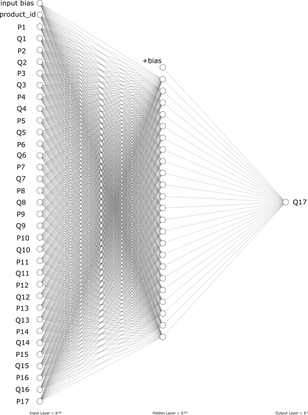
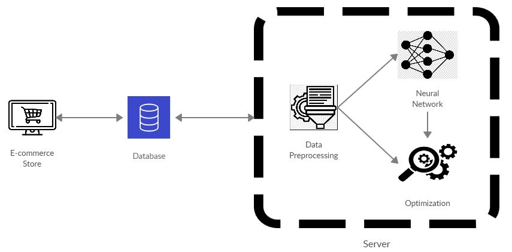

# Dynamic Pricing & Demand Forecasting Engine

An end-to-end Machine Learning pipeline that ingests historical e-commerce data, trains a neural network for demand forecasting, and optimizes product pricing using Particle Swarm Optimization (PSO). This project demonstrates the ability to combine predictive modeling with mathematical optimization to maximize profitability.

---

## 🏗 Architecture

The system is broken down into three main computational stages:

1.  **Data Preprocessing (`data.py`)**: Cleans raw historical sales data, aggregates it into weekly metrics, and prepares tensors for Neural Network consumption.
2.  **Predictive Modeling (`neural_network.py`)**: A deep learning model that learns the non-linear relationship between price, seasonality, and customer demand. Saves the best weights to `final_model.h5`.
3.  **Price Optimization (`pso.py`)**: Utilizes Particle Swarm Optimization (PSO) to explore the pricing search space. It uses the trained Neural Network as its objective function to find the exact price point that maximizes simulated profit margins.

---

## 🚀 Getting Started

### Prerequisites
- Python 3.9+
- pip

### Installation

1. Clone the repository:
```bash
git clone https://github.com/Kiruthick7/Dynamic-Pricing-System-for-E-commerce.git
cd Dynamic-Pricing-System-for-E-commerce
```

2. Install dependencies (TensorFlow/Keras, Pandas, NumPy, Scikit-learn):
```bash
pip install -r requirements.txt
```

### Running the Pipeline

You can run the entire pipeline from start to finish using the main orchestrator:

```bash
python main.py
```
*This will execute data preprocessing, train the neural network, and finally output the optimized pricing recommendations.*

---

## 📸 Visuals

*(Add a screenshot of the Loss/Accuracy training curves or the final PSO pricing output table here)*


*(Add a screenshot of the system architecture or data flow here)*


---

## 📁 Repository Structure

```text
├── data/                  # Raw and processed datasets
│   ├── data_insert.py     # Scripts for database seeding
│   └── update_data.py     # Scripts for real-time data ingestion
├── images/                # Visual assets for documentation
├── data.py                # Core ETL and preprocessing logic
├── neural_network.py      # Keras/TensorFlow model definition and training
├── pso.py                 # Particle Swarm Optimization algorithm
├── main.py                # Main execution orchestrator
└── final_model.h5         # Compiled model weights (generated after training)
```

## 🧠 Tech Stack
- **Languages**: Python
- **Machine Learning**: TensorFlow / Keras
- **Optimization**: Custom PSO algorithm
- **Data Manipulation**: Pandas, NumPy
